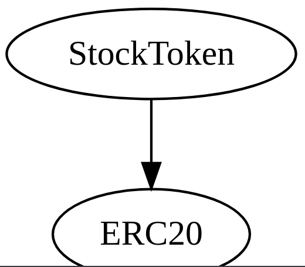

Share-Market-Smart-Contract-Docs

# Share-Market-Smart-Contract
Github: [aliimran2000](github.com/aliimran2000)

- The words share and stock  have been used interchangeabliy throughout this project

## Working
### Main Working : 
- users (all members of the network) can purchase stocks from the stock market
- users can post stocks for sale which other users can buy and/or buy directly from the company.
- Each seller can set their own Cost for the transaction
- the currency for the system is `StockToken` **(STT)**

### Governence 
- the initial governer is the contract owner 
- can add other governers to the list of governers
- governers control : 
	1. Company Approval
	2. Add Other Governers to the list of governers
	
### Company 
A company can be created by any user
#### process : 
1. - user request a company creation in which they are required to enter 
	- Name
	- num of stocks
	- stock price	
2. a governer then approves the company request , before that the company is not elligable to sell its stocks

### Stock Token 
- Simple ERC20 Token with top up facility 
- initial supply is provided to the contract address

***
## Diagrams
### Inheritence

***

***

### interaction

