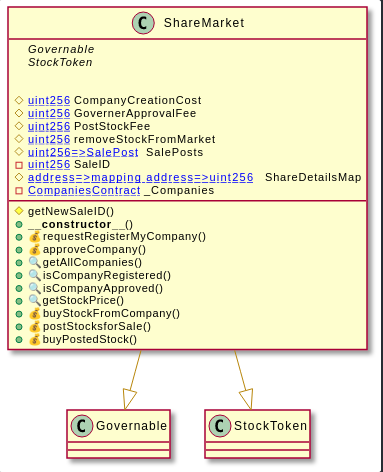
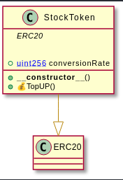
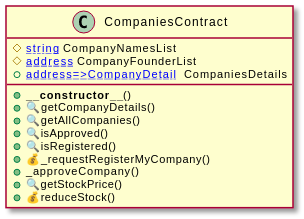
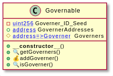
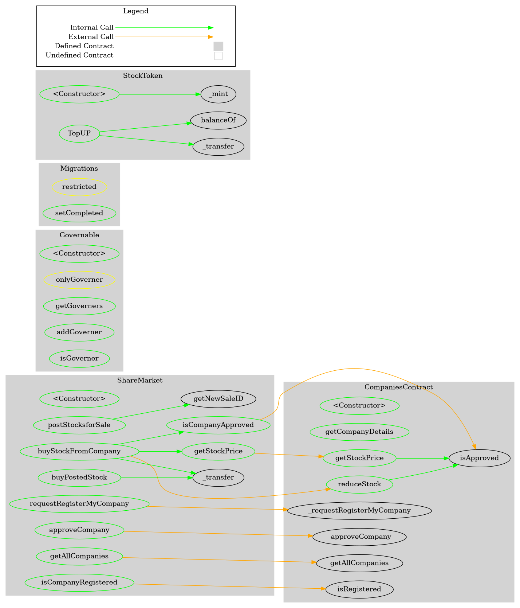

Share-Market-Smart-Contract-Docs

# Share-Market-Smart-Contract
Github: [aliimran2000](github.com/aliimran2000)

- The words share and stock  have been used interchangeabliy throughout this project

## Working
### Main Working : 
- users (all members of the network) can purchase stocks from the stock market
- users can post stocks for sale which other users can buy and/or buy directly from the company.
- Each seller can set their own Cost for the transaction
- the currency for the system is `StockToken` **(STT)**

### Governence 
- the initial governer is the contract owner 
- can add other governers to the list of governers
- governers control : 
	1. Company Approval
	2. Add Other Governers to the list of governers
	
### Company 
A company can be created by any user
#### process : 
1. - user request a company creation in which they are required to enter 
	- Name
	- num of stocks
	- stock price	
2. a governer then approves the company request , before that the company is not elligable to sell its stocks

### Stock Token 
- Simple ERC20 Token with top up facility 
- initial supply is provided to the contract address

***
## Contracts

### Share Market

793a1a06  =>  getNewSaleID()
07498ab5  =>  requestRegisterMyCompany(string,uint256,uint256)
3cf079f0  =>  approveCompany(address)
408bf4c3  =>  getAllCompanies()
56ea04a3  =>  isCompanyRegistered(address)
62f0dc3f  =>  isCompanyApproved(address)
3d3325e0  =>  getStockPrice(address)
97f24f9c  =>  buyStockFromCompany(address,uint256)
5ca779e5  =>  postStocksforSale(address,uint256,uint256)
a6dcd15b  =>  buyPostedStock(uint256)

***
### Stock Token

0c922ff5  =>  TopUP()

***
### CompaniesContract

0558d3e9  =>  getCompanyDetails(address)
408bf4c3  =>  getAllCompanies()
673448dd  =>  isApproved(address)
c3c5a547  =>  isRegistered(address)
bf9c2a4c  =>  _requestRegisterMyCompany(address,string,uint256,uint256)
a5bdfed9  =>  _approveCompany(address)
3d3325e0  =>  getStockPrice(address)
aff9afcb  =>  reduceStock(address,uint256)

***
### Governable

3fbbc7e9  =>  getGoverners()
a5068c98  =>  addGoverner(address,string)
31ecd8ee  =>  isGoverner(address)

***

## Interaction

